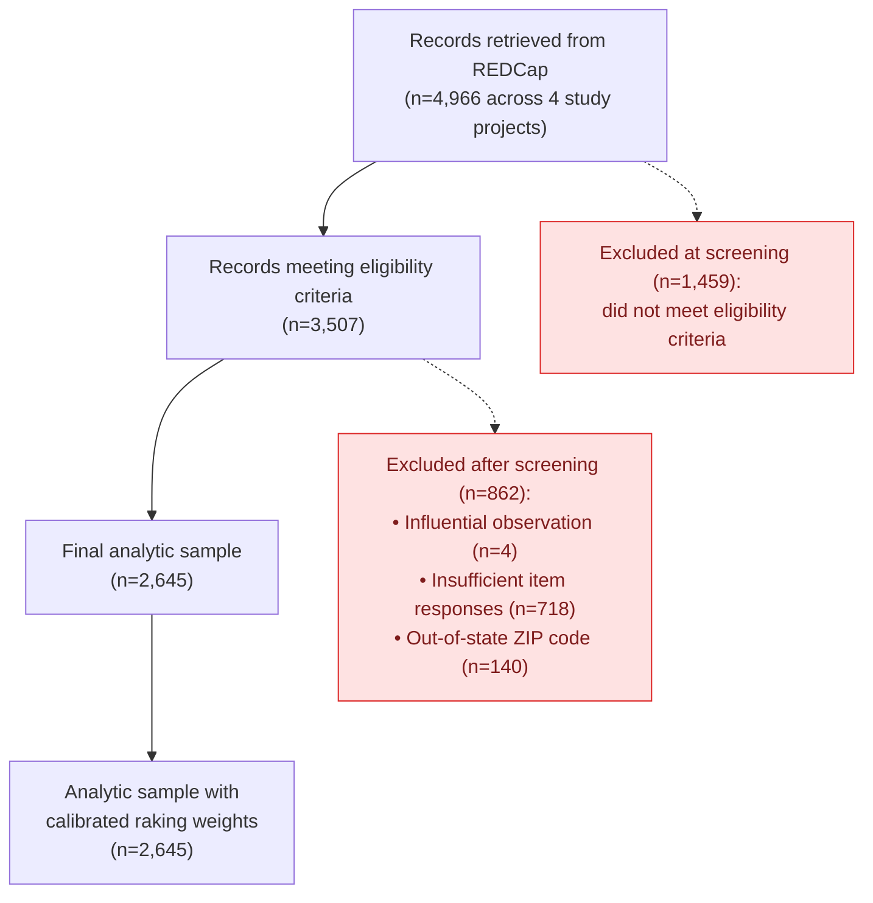

# PRISMA Flow Diagram — NE25 Pipeline (minimal, NE25-only)

This skill produces a four-stage PRISMA-style diagram (Identification → Screening → Eligibility → Included) for the NE25 analytic sample. Row counts are pulled live from DuckDB; the user signs off on box layout and exclusion-reason wording before export.

## When to invoke

- Writing a methods section for a paper using the NE25 analytic sample
- Updating `docs/raking/ne25/WEIGHT_CONSTRUCTION.qmd` to show how N=2,645 was derived from N=4,966
- Onboarding a collaborator who needs to see what was excluded and why
- Auditing the chain from raw REDCap pull to weighted analytic sample

**Do not invoke for:** MN26 (different gate structure, different unit of analysis — see the future `prisma-mn26` skill once it exists), generic "explain the pipeline" requests (use the per-pipeline `.qmd` guide), or one-off row-count questions (just query the DB).

## What this skill produces

A Mermaid `flowchart TD` block with:
- **Top box** — total records identified (with REDCap project count)
- **Screening exclusion** — failed-eligibility records, with optional 9-criteria sub-bullets
- **Eligible box** — pre-analytic-filter sample
- **Eligibility-stage exclusions** — influence + items + geography (laid out per Phase-2 decisions)
- **Analytic-sample box** — `meets_inclusion = TRUE`
- **Final box** — analytic sample with calibrated raking weights

Counts come from `ne25_transformed`. The diagram is rendered in chat first; the user reviews; the user chooses an export target.

## Workflow (3 phases, 2 HITL checkpoints)

### Phase 1 — Inventory (automated)

Query DuckDB for the gate counts that define the sample. Use the `python.db.connection.DatabaseManager` context-manager pattern — `db.execute_query()` does **not** exist:

```python
import sys, os
sys.path.insert(0, os.getcwd())
from python.db.connection import DatabaseManager

GATES = {
    "raw_total":         "SELECT COUNT(*) FROM ne25_raw",
    "redcap_projects":   "SELECT COUNT(DISTINCT pid) FROM ne25_raw",
    "eligible_true":     "SELECT COUNT(*) FROM ne25_transformed WHERE eligible",
    "eligible_false":    "SELECT COUNT(*) FROM ne25_transformed WHERE NOT eligible",
    "influential":       "SELECT COUNT(*) FROM ne25_transformed WHERE eligible AND influential",
    "too_few_items":     "SELECT COUNT(*) FROM ne25_transformed WHERE eligible AND too_few_item_responses",
    "out_of_state":      "SELECT COUNT(*) FROM ne25_transformed WHERE eligible AND out_of_state",
    "meets_inclusion":   "SELECT COUNT(*) FROM ne25_transformed WHERE meets_inclusion",
    "with_weight":       "SELECT COUNT(*) FROM ne25_transformed WHERE calibrated_weight IS NOT NULL",
}
db = DatabaseManager()
with db.get_connection(read_only=True) as con:
    counts = {k: con.execute(sql).fetchone()[0] for k, sql in GATES.items()}
```

Also probe overlaps and consistency. The schema does **not** enforce disjointness among `influential`, `too_few_item_responses`, and `out_of_state`, so verify rather than assume:

```python
PROBES = {
    "elig_AND_oos":         "SELECT COUNT(*) FROM ne25_transformed WHERE eligible AND out_of_state",
    "ineligible_AND_oos":   "SELECT COUNT(*) FROM ne25_transformed WHERE NOT eligible AND out_of_state",
    "influ_AND_tfi":        "SELECT COUNT(*) FROM ne25_transformed WHERE influential AND too_few_item_responses",
    "influ_AND_oos":        "SELECT COUNT(*) FROM ne25_transformed WHERE influential AND out_of_state",
    "tfi_AND_oos":          "SELECT COUNT(*) FROM ne25_transformed WHERE too_few_item_responses AND out_of_state",
    "incl_no_weight":       "SELECT COUNT(*) FROM ne25_transformed WHERE meets_inclusion AND calibrated_weight IS NULL",
}
```

Run an **arithmetic reconciliation** in chat:

```
eligible_true − (influential ∩ eligible) − (too_few_items ∩ eligible) − (out_of_state ∩ eligible)
  + any_pairwise_overlap
  =? meets_inclusion
```

If the equation balances and all pairwise overlap probes are 0 and `incl_no_weight = 0`, declare the sample structure clean. If any probe is non-zero, surface it explicitly — overlapping exclusions change how the diagram should be laid out (sub-bullets vs. parallel boxes).

Render a **draft** Mermaid block in chat using the live numbers and the default layout (see template below). Annotate any anomalies above the draft.

### Phase 2 — Refinement (HITL — checkpoint #1)

Present these decisions to the user **explicitly and one at a time**. Do not proceed to Phase 3 until each is answered. The point of the skill is that the human signs off on stage labels — automating these choices defeats the purpose.

1. **`out_of_state` placement.** Out-of-state records have no PUMA match and are mechanically forced to `meets_inclusion = FALSE` (Step 6.10). Three reasonable PRISMA placements:
   - (a) **Screening-stage exclusion** alongside the 9 eligibility criteria (treat geographic validity as part of eligibility)
   - (b) **Eligibility-stage exclusion** alongside influence and items (treat it as a post-eligibility analytic filter)
   - (c) **Standalone fourth box** at the eligibility stage (highlights that geography is structurally different from data-quality exclusions)
   - Per the user's standing preference, this is *not* a "bandaid" — Step 6.10 is the final treatment. Phrase any label accordingly.

2. **Box granularity.** Collapse the three eligibility-stage exclusions (influential, too_few_items, out_of_state) into one box with sub-bullets, or keep them as three sibling boxes? Sub-bullets read more naturally in a methods section; sibling boxes read better in a slide.

3. **Screening-stage breakdown.** The 1,459 ineligible records failed one or more of the 9 eligibility criteria. Note: `ne25_eligibility` has 0 rows (drift), so the per-criterion breakdown is **not currently queryable**. Options:
   - Show a single "Did not meet eligibility criteria (n=1,459)" box with no breakdown (recommended for v1)
   - Include the 9 criterion *names* (without counts) as a footnote
   - Defer this decision to a future skill version that re-populates `ne25_eligibility`

4. **Methods-section wording.** Confirm or rewrite each box label. Defaults the skill should propose:
   - Top: "Records retrieved from REDCap (n=4,966 across 4 study projects)"
   - Screening exclusion: "Did not meet eligibility criteria (n=1,459)"
   - Eligible: "Records meeting eligibility criteria (n=3,507)"
   - Eligibility exclusions: "Influential observation (n=4)" / "Insufficient item responses for scoring (n=718)" / "Out-of-state ZIP code (n=140)"
   - Analytic: "Final analytic sample (n=2,645)"
   - Weighted: "Analytic sample with calibrated raking weights (n=2,645)"
   - Internal pipeline names ("too_few_item_responses") are not publication-friendly. The user knows the target journal's voice; defer to them.

5. **Anything to add?** Examples the user might call for:
   - A note that the analytic sample equals the weighted sample (the equality of the bottom two boxes is a non-obvious property worth annotating)
   - A side-callout for the `ne25_kidsights_gsed_pf_scores_2022_scale` (2,785 records) — slightly larger than the analytic sample, reflecting a different exclusion rule
   - Date stamp / pipeline version

### Phase 3 — Export (automated, after sign-off — checkpoint #2)

Render the final Mermaid block. Then ask the user where it goes:

| Target | When to use | Path |
|---|---|---|
| Chat only | Quick look, draft for a coauthor email | (no file) |
| Standalone Quarto doc | Reusable, renderable to HTML/PDF, lives in repo | `docs/ne25/prisma_diagram.qmd` |
| Append to weight-construction narrative | Methods section for the weighting writeup | `docs/raking/ne25/WEIGHT_CONSTRUCTION.qmd` (new subsection) |
| Local HTML / PDF render | Visual review or coauthor email; transient artifact, not committed | `tmp/ne25_prisma.{html,pdf}` (project-scoped, gitignored) |

**Path convention — important.** Local-only diagram artifacts go in the project's `tmp/` directory, **not** the global `~/.agent/diagrams/` scratch space. The repo's `.gitignore` covers `tmp/` entirely and also globally ignores `*.html` and `*.pdf` (with explicit `!docs/...` exceptions for committed pages), so files dropped in `tmp/` are automatically untracked — no risk of accidentally committing a methods figure.

Per the user's standing preference, **prefer Quarto over plain Markdown** for any committed artifact.

If writing to file:
- Confirm the path with the user before writing (especially for `WEIGHT_CONSTRUCTION.qmd`, which is hand-curated prose)
- Include a generation date and a note that counts are live as of that date
- **Do not commit or push.** The user decides when the diagram lands in version control.

## Default Mermaid template

The skill replaces the illustrative numbers below with live counts from Phase 1.



## Constraints (non-negotiable)

- **Live counts only.** Never copy numbers from CLAUDE.md or a prior diagram. The doc-stated numbers can drift; the live `ne25_transformed` query is authoritative.
- **Read-only.** Never write to the database, never modify `ne25_transformed`, never re-run the pipeline.
- **Mermaid as the default output.** No external JS, no Graphviz, no LaTeX. The R `PRISMA2020` package is a deliberate future extension, not the v1 default.
- **Two HITL checkpoints are required.** Even if the answers feel obvious, ask. The skill exists *because* the human signs off on stage labels.
- **No commit, no push.** The diagram is a methods artifact; landing it in version control is the user's call.

## Anti-patterns (do not repeat)

- Producing a final diagram in one shot without user review (defeats the HITL premise).
- Hardcoding the documented "2,645" instead of querying live (the documented figure can drift; the live count is authoritative).
- Reaching for `ne25_eligibility` to break down the 1,459 by criterion — that table is currently empty (drift). Use `ne25_transformed.eligible`.
- Inventing methods-section wording without asking. Internal pipeline column names ("too_few_item_responses", "influential") are not publication-friendly.
- Treating Step 6.10 (out-of-state) as a "bandaid" or "workaround" in the diagram label. It is the final treatment for records with no PUMA match.
- Auto-committing the rendered `.qmd` or appending to `WEIGHT_CONSTRUCTION.qmd` without explicit user authorization for each landing site.
- Writing diagram artifacts to `~/.agent/diagrams/` (the global, cross-project Claude scratch space). That path mixes Kidsights methods figures with unrelated artifacts from other projects and bypasses the repo's own `tmp/` convention. Use `tmp/` for any local-only render.

## Success criteria

- The diagram's row counts reconcile arithmetically (top minus exclusions equals bottom; analytic equals weighted).
- The arithmetic reconciliation in Phase 1 ran and either passed or surfaced a discrepancy for user adjudication.
- Every exclusion box has a label the user explicitly approved in Phase 2.
- The output landed in the location the user chose in Phase 3 — chat-only, a new `.qmd`, or appended to an existing one.
- No DB writes, no commits, no pushes happened during the skill run.

## Future extensions (out of scope for v1)

- **MN26 variant** (`prisma-mn26`). Different unit of analysis (children vs households via `pid + record_id + child_num`), different eligibility set (4 criteria vs NE25's 9), no calibrated weights yet. Will need its own skill, not a parameter on this one.
- **Re-populated `ne25_eligibility`.** If the per-criterion eligibility table is rebuilt, Phase 2 question 3 expands to allow real per-criterion sub-bullets in the screening box.
- **PRISMA2020 R-package output.** For publication-grade SVG/PDF (JAMA, BMJ). Requires `PRISMA2020` and a rendering pass; defer until a journal explicitly demands it.
- **Diagnostics dataset diagram.** A second diagram showing how `ne25_kidsights_gsed_pf_scores_2022_scale` (2,785 records) and `ne25_too_few_items` (718) relate to the analytic sample — useful for the IRT scoring writeup, not the weighting writeup.
