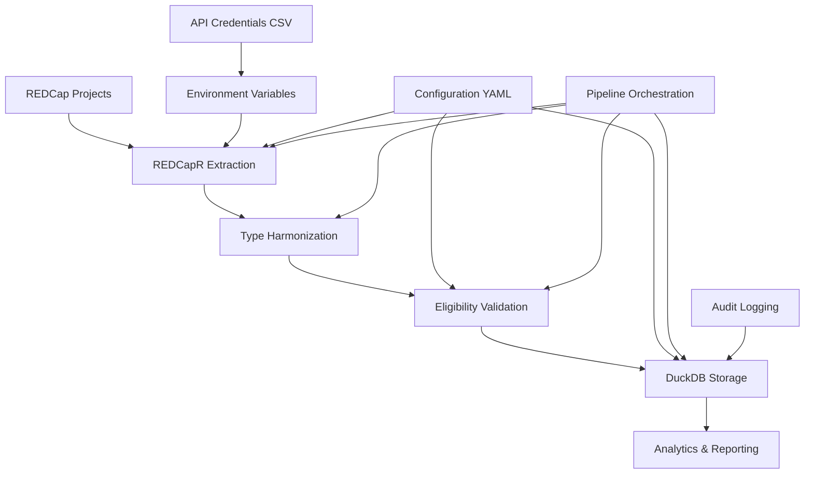

# NE25 Pipeline Architecture and Data Flow

This document provides detailed technical documentation of the NE25 (Nebraska 2025) data pipeline architecture, components, and data flow.

## Pipeline Overview

The NE25 pipeline is a comprehensive ETL (Extract, Transform, Load) system that:
1. Extracts data from multiple REDCap projects via API
2. Harmonizes data types across different project schemas
3. Validates participant eligibility using 9 criteria
4. Transforms and stores data in DuckDB for analysis
5. Logs all execution metrics and errors

## High-Level Architecture



## Components Deep Dive

### 1. Credential Management (`load_api_credentials`)

**File**: `pipelines/orchestration/ne25_pipeline.R:271-302`

**Purpose**: Securely loads API tokens from CSV and sets environment variables

**Process**:
1. Reads CSV file with project credentials
2. Validates required columns: `project`, `pid`, `api_code`
3. Sets environment variables: `KIDSIGHTS_API_TOKEN_{PID}`
4. Provides secure token access for API calls

**Security Features**:
- CSV file stored outside git repository
- No hardcoded credentials in source code
- Environment variables cleared after pipeline execution

### 2. REDCap Data Extraction (`extract_redcap_project_data`)

**File**: `R/extract/ne25.R`

**Purpose**: Extracts raw data from REDCap projects using REDCapR

**Process**:
1. Retrieves API token from environment variable
2. Calls REDCap API with authentication
3. Extracts all forms/instruments from project
4. Adds metadata: `retrieved_date`, `source_project`, `extraction_id`, `pid`
5. Applies rate limiting (1-second delays between projects)

**Data Sources**:
- Project 7679: `kidsights_data_survey`
- Project 7943: `kidsights_followup_survey`
- Project 7999: `kidsights_additional_survey`
- Project 8014: `kidsights_final_survey`

### 3. Type Harmonization (`flexible_bind_rows`)

**File**: `R/extract/ne25.R:15-89`

**Purpose**: Combines data from multiple projects with different schemas

**Type Conversion Hierarchy**:
1. **datetime** (highest priority)
2. **character**
3. **numeric**
4. **logical** (lowest priority)

**Process**:
1. Identifies all unique columns across projects
2. Determines target type using conversion hierarchy
3. Converts columns to common type with warnings
4. Binds all project data into single data frame

**Example Conversion**:
```r
# Project A: eligibility_form_timestamp <datetime>
# Project B: eligibility_form_timestamp <character>
# Result: Both converted to character type
```

### 4. Eligibility Validation (`check_ne25_eligibility`)

**File**: `R/harmonize/ne25_eligibility.R`

**Purpose**: Validates participants against 9 eligibility criteria (CID1-CID9)

**Validation Criteria**:

| Criteria | Field | Description |
|----------|-------|-------------|
| **CID1** | Compensation acknowledgment | All 4 compensation checkboxes selected |
| **CID2** | Informed consent | `eq001 = 1` (Yes to consent) |
| **CID3** | Caregiver status | `eq002 = 1` AND `eq003 = 1` (Primary caregiver, 19+) |
| **CID4** | Child age | `age_in_days` between 0-2190 days (0-6 years) |
| **CID5** | Nebraska residence | `eqstate = 31` (Nebraska state code) |
| **CID6** | ZIP/county match | Geographic consistency validation |
| **CID7** | Birthday confirmation | `date_complete_check = 1` |
| **CID8** | KMT quality | Survey completion quality checks |
| **CID9** | Survey completion | Required forms completed |

**Output Categories**:
- **Eligibility**: Pass/Fail based on CID2-CID7
- **Authenticity**: Pass/Fail based on CID8-CID9
- **Compensation**: Pass/Fail based on CID1
- **Overall Include**: Eligible AND Authentic AND Compensation

### 5. Database Storage (`insert_ne25_data`, `upsert_ne25_data`)

**File**: `R/duckdb/connection.R`

**Purpose**: Stores processed data in DuckDB with proper schema

**Storage Process**:
1. Connects to DuckDB at OneDrive location
2. Initializes schema if tables don't exist
3. Inserts/updates data with conflict resolution
4. Creates indexes for query performance
5. Logs execution metrics

**Data Tables**:
- `ne25_raw`: Original REDCap data with metadata
- `ne25_eligibility`: Validation results for all criteria
- `ne25_harmonized`: Transformed data ready for analysis
- `ne25_pipeline_log`: Execution history and metrics

## Data Flow Stages

### Stage 1: Configuration and Credentials
```
ne25.yaml → load_api_credentials() → Environment Variables
```

### Stage 2: Multi-Project Extraction
```
For each REDCap project:
  API Token → REDCapR::redcap_read() → Raw Project Data
  Add metadata (retrieved_date, source_project, pid)
  Rate limiting (1-second delay)
```

### Stage 3: Data Harmonization
```
Project Data Lists → flexible_bind_rows() → Combined Dataset
  - Type conflict resolution
  - Column alignment
  - Conversion warnings
```

### Stage 4: Data Validation
```
Combined Data → check_ne25_eligibility() → Eligibility Results
  - CID1-CID9 validation
  - Pass/Fail categorization
  - Inclusion determination
```

### Stage 5: Database Storage
```
Validated Data → DuckDB Operations → Persistent Storage
  - Raw data → ne25_raw
  - Eligibility → ne25_eligibility
  - Harmonized → ne25_harmonized
  - Metrics → ne25_pipeline_log
```

## Pipeline Orchestration

### Main Execution Flow (`run_ne25_pipeline`)

**File**: `pipelines/orchestration/ne25_pipeline.R:22-269`

```r
# 1. Initialize execution context
execution_id <- paste0("ne25_", format(Sys.time(), "%Y%m%d_%H%M%S"))
metrics <- initialize_metrics()

# 2. Load configuration and connect to database
config <- yaml::read_yaml("config/sources/ne25.yaml")
con <- connect_kidsights_db()

# 3. Load API credentials
load_api_credentials(config$redcap$api_credentials_file)

# 4. Extract data from all projects
for (project in config$redcap$projects) {
  project_data <- extract_redcap_project_data(url, token, config)
  projects_data[[project$name]] <- project_data
}

# 5. Harmonize data types
combined_data <- flexible_bind_rows(projects_data)

# 6. Validate eligibility
eligibility_results <- check_ne25_eligibility(combined_data, config)

# 7. Store in database
insert_ne25_data(con, combined_data, "ne25_raw")
insert_ne25_data(con, eligibility_results, "ne25_eligibility")

# 8. Transform and store harmonized data
harmonized_data <- transform_for_analysis(eligibility_results)
insert_ne25_data(con, harmonized_data, "ne25_harmonized")

# 9. Log execution metrics
log_pipeline_execution(con, execution_id, metrics, "success")
```

## Error Handling and Recovery

### Exception Management
- **API Failures**: Individual project failures don't stop entire pipeline
- **Type Conversion**: Warnings logged but pipeline continues
- **Database Errors**: Rollback mechanisms prevent partial writes
- **Validation Issues**: Detailed error logging for debugging

### Recovery Mechanisms
- **Incremental Updates**: Support for `overwrite_existing = FALSE`
- **Execution Logging**: Full audit trail for troubleshooting
- **Status Tracking**: Success/failure status for each component

## Performance Characteristics

### Typical Execution Metrics
- **Total Records**: ~3,900+ participants
- **Extraction Time**: ~30-60 seconds (4 projects)
- **Processing Time**: ~10-20 seconds
- **Total Duration**: ~60-90 seconds
- **Database Size**: ~15-25 MB

### Optimization Features
- **Rate Limiting**: Prevents API overload
- **Indexed Tables**: Fast query performance
- **Columnar Storage**: Efficient analytics queries
- **Batch Operations**: Bulk inserts for performance

## Configuration Management

### Primary Config (`config/sources/ne25.yaml`)
```yaml
redcap:
  url: "https://redcap.ucdenver.edu/api/"
  api_credentials_file: "C:/Users/waldmanm/my-APIs/kidsights_redcap_api.csv"
  projects:
    - name: "kidsights_data_survey"
      pid: 7679
      token_env: "KIDSIGHTS_API_TOKEN_7679"

output:
  database_path: "C:/Users/waldmanm/OneDrive - The University of Colorado Denver/Kidsights-duckDB/kidsights.duckdb"

eligibility:
  # Eligibility criteria configuration
  age_min_days: 0
  age_max_days: 2190
  nebraska_state_code: 31
```

## Monitoring and Observability

### Execution Logging
```sql
SELECT
  execution_id,
  execution_date,
  pipeline_type,
  total_records_extracted,
  records_eligible,
  records_included,
  total_duration_seconds,
  status
FROM ne25_pipeline_log
ORDER BY execution_date DESC;
```

### Data Quality Metrics
```sql
SELECT
  COUNT(*) as total_records,
  COUNT(CASE WHEN include = TRUE THEN 1 END) as included_records,
  ROUND(100.0 * COUNT(CASE WHEN include = TRUE THEN 1 END) / COUNT(*), 1) as inclusion_rate
FROM ne25_eligibility;
```

## Integration Points

### Dashboard Compatibility
- Mirrors extraction logic from existing Kidsights Dashboard
- Uses same `flexible_bind_rows` type harmonization
- Compatible field mappings and transformations

### Future Extensions
- Additional data sources (Census, healthcare, education)
- Real-time data streaming capabilities
- Advanced analytics and ML pipelines
- Automated quality control systems

---

**Last Updated**: January 2025
**Architecture Version**: 1.0.0