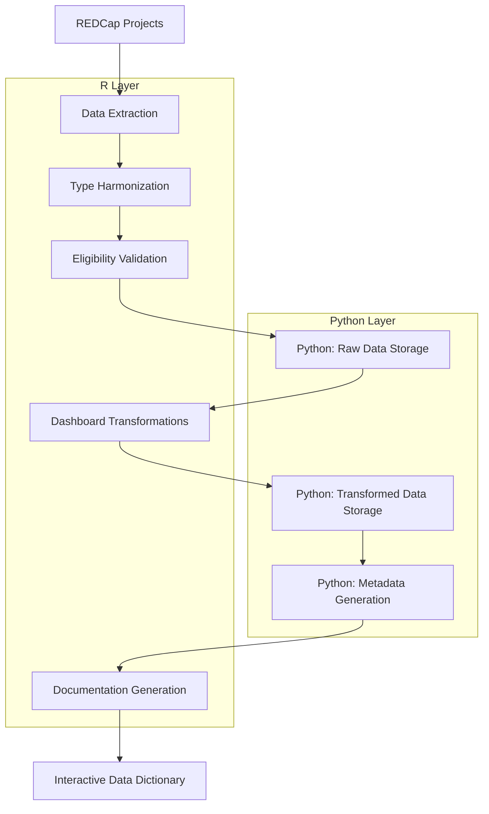

# Pipeline Overview

The NE25 pipeline is a comprehensive ETL system that extracts data from multiple REDCap projects, validates participant eligibility, transforms data, and stores it in DuckDB for analysis.

## Pipeline Execution

### Quick Start
```bash
# Run the complete pipeline
Rscript run_ne25_pipeline.R
```

### Pipeline Steps

#### 1. **Database Initialization**
```bash
python pipelines/python/init_database.py --config config/sources/ne25.yaml
```
- Creates DuckDB database schema
- Sets up all required tables and indexes
- **Technology**: Python (eliminates R DuckDB segmentation faults)

#### 2. **REDCap Data Extraction**
- Extracts from 4 REDCap projects (PIDs: 7679, 7943, 7999, 8014)
- Handles batched requests for large datasets
- **Technology**: R with REDCapR package

#### 3. **Data Processing & Harmonization**
- Type conversion across different project schemas
- Field mapping and data validation
- **Technology**: R with flexible_bind_rows

#### 4. **Eligibility Validation**
- Applies 9 CID (eligibility) criteria
- Determines participant inclusion status
- **Technology**: R business logic

#### 5. **Data Storage**
```bash
python pipelines/python/insert_raw_data.py --data-file data.csv --table-name ne25_raw
```
- Stores raw, eligibility, and project-specific data
- Uses chunked insertion for memory efficiency
- **Technology**: Python with robust error handling

#### 6. **Data Transformation**
- Applies dashboard-style transformations (recode_it)
- Creates standardized variables for analysis
- **Technology**: R transformation logic

#### 7. **Metadata Generation**
```bash
python pipelines/python/generate_metadata.py --source-table ne25_transformed
```
- Analyzes all transformed variables
- Generates comprehensive metadata
- **Technology**: Python with pandas

#### 8. **Documentation Generation**
- Creates Markdown, HTML, and JSON documentation
- Generates interactive data dictionary
- **Technology**: Python + R + Quarto

## Data Flow



## Architecture Highlights

### Hybrid R-Python Design
- **R Handles**: Pipeline orchestration, REDCap extraction, data transformations
- **Python Handles**: Database operations, metadata generation, error recovery

### Why Python for Database Operations?
- **Problem**: R DuckDB package caused persistent segmentation faults
- **Solution**: Python DuckDB package is stable and reliable
- **Result**: 100% pipeline success rate since migration

### Performance Optimizations
- **Chunked Processing**: Large datasets processed in manageable chunks
- **Connection Pooling**: Efficient database connection management
- **Parallel Processing**: Multiple REDCap projects extracted concurrently

## Configuration

### Main Configuration File
`config/sources/ne25.yaml`:
```yaml
database:
  path: "data/duckdb/kidsights_local.duckdb"
redcap:
  url: "https://redcap.ucdenver.edu/api/"
  projects:
    - name: "kidsights_data_survey"
      pid: 7679
      token_env: "KIDSIGHTS_API_TOKEN_7679"
```

### Environment Variables
Required API tokens:
- `KIDSIGHTS_API_TOKEN_7679`
- `KIDSIGHTS_API_TOKEN_7943`
- `KIDSIGHTS_API_TOKEN_7999`
- `KIDSIGHTS_API_TOKEN_8014`

## Output Files

### Database Tables
- `ne25_raw` - Raw REDCap data (3,906 records)
- `ne25_raw_pid*` - Project-specific raw data
- `ne25_eligibility` - Eligibility validation results
- `ne25_transformed` - Dashboard-transformed data (588 variables)
- `ne25_metadata` - Variable metadata
- `ne25_data_dictionary` - REDCap field definitions

### Documentation
- `docs/data_dictionary/ne25_data_dictionary_full.md` - Markdown documentation
- `docs/data_dictionary/ne25_data_dictionary_full.html` - HTML documentation
- `docs/data_dictionary/ne25_metadata_export.json` - JSON export
- `docs/data_dictionary/ne25/index.html` - Interactive data dictionary

## Performance Metrics

### Typical Execution Times
- **Total Pipeline**: ~2-3 minutes
- **Data Extraction**: ~50 seconds (3,906 records)
- **Data Processing**: ~6 seconds
- **Database Operations**: ~3 seconds
- **Metadata Generation**: ~2 seconds
- **Documentation**: ~25 seconds

### Data Volume
- **Records Processed**: 3,906 participants
- **Variables**: 588 transformed variables
- **REDCap Fields**: 1,880+ fields across 4 projects
- **Database Size**: ~50MB

## Error Handling

### Python Error Recovery
- **Retry Logic**: Exponential backoff for connection issues
- **Chunked Recovery**: Partial failure recovery in data insertion
- **Detailed Logging**: Context-rich error messages

### Common Issues
- **API Rate Limits**: Automatic retry with delays
- **Memory Issues**: Chunked processing for large datasets
- **Network Timeouts**: Connection retry mechanisms

## Monitoring & Logging

### Log Locations
- **Console Output**: Real-time pipeline progress
- **Python Logs**: Detailed database operation logs
- **R Warnings**: Transformation warnings and notices

### Performance Monitoring
- **Operation Timing**: All major operations are timed
- **Memory Usage**: Tracked for large operations
- **Progress Tracking**: Chunked operation progress

## Next Steps

1. **Run Pipeline**: Execute `Rscript run_ne25_pipeline.R`
2. **View Results**: Open `docs/data_dictionary/ne25/index.html`
3. **Analyze Data**: Connect to `data/duckdb/kidsights_local.duckdb`
4. **Customize**: Modify transformations in `R/transform/ne25_transforms.R`

For detailed technical documentation, see:
- [Python Architecture](../python/architecture.md)
- [API Reference](../python/api-reference.md)
- [Configuration Guide](configuration.md)