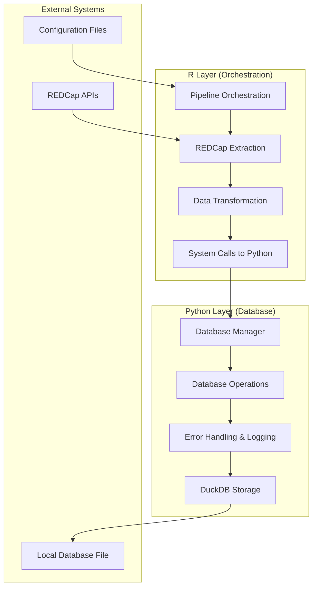
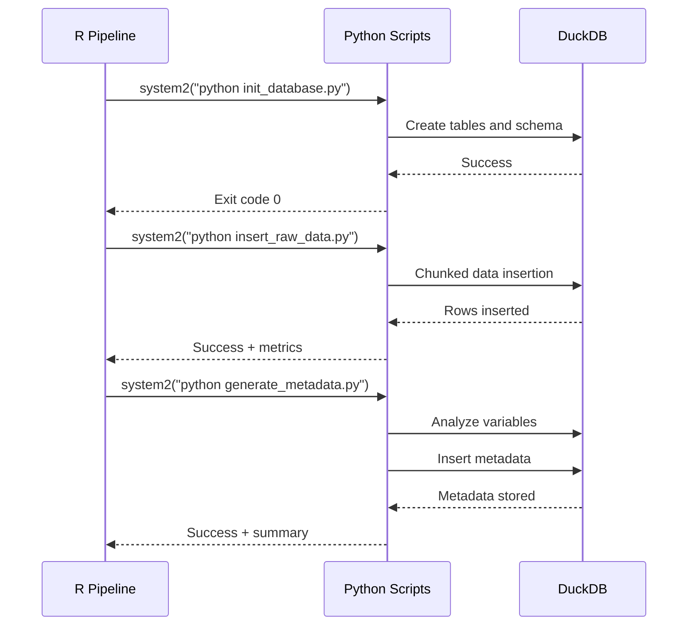

# Python Architecture Overview

The Kidsights Data Platform uses a hybrid Python-R architecture implemented in September 2025 to solve persistent segmentation faults in R's DuckDB package.

## Architecture Decision

**Problem**: R's DuckDB package caused consistent segmentation faults during database operations, making the pipeline unreliable.

**Solution**: Migrate all database operations to Python while maintaining R for pipeline orchestration and REDCap extraction.

## System Architecture



## Component Responsibilities

### R Components
- **Pipeline Orchestration**: Controls overall workflow execution
- **REDCap Extraction**: Handles API calls and data retrieval
- **Data Transformation**: Applies business logic transformations
- **Python Integration**: Makes system calls to Python scripts

### Python Components
- **Database Management**: Connection pooling and configuration
- **Data Operations**: Insert, query, and metadata generation
- **Error Handling**: Robust error recovery and logging
- **Schema Management**: Database initialization and migrations

## Python Module Structure

```
python/
├── __init__.py
├── db/
│   ├── __init__.py
│   ├── connection.py      # DatabaseManager class
│   ├── operations.py      # DatabaseOperations class
│   └── config.py          # Configuration loading
└── utils/
    ├── __init__.py
    └── logging.py          # Enhanced logging utilities
```

## Key Benefits

### 🔒 **Stability**
- **No Segmentation Faults**: Python DuckDB package is stable
- **Robust Error Handling**: Comprehensive exception management
- **Retry Logic**: Automatic recovery from transient failures

### 📊 **Performance**
- **Connection Pooling**: Efficient database connections
- **Chunked Processing**: Memory-efficient large dataset handling
- **Performance Monitoring**: Built-in timing and metrics

### 🔍 **Observability**
- **Structured Logging**: Detailed operation context
- **Error Classification**: Retryable vs non-retryable errors
- **Execution Tracking**: Performance metrics for all operations

### 🛠️ **Maintainability**
- **Clear Separation**: R and Python have distinct responsibilities
- **Modular Design**: Independent, testable components
- **Configuration-Driven**: YAML-based configuration management

## Data Flow



## Error Handling Strategy

### Connection Errors
- **Exponential Backoff**: Automatic retry with increasing delays
- **Permission Checks**: Validate file access before connection
- **Connection Testing**: Verify database availability

### Operation Errors
- **Chunked Processing**: Partial failure recovery
- **Error Classification**: Distinguish retryable vs fatal errors
- **Detailed Logging**: Context-rich error messages

### Performance Monitoring
- **Operation Timing**: Track execution duration
- **Memory Usage**: Monitor resource consumption
- **Progress Tracking**: Chunked operation progress

## Configuration

### YAML Configuration
```yaml
database:
  path: "data/duckdb/kidsights_local.duckdb"
  config:
    threads: 4
    memory_limit: "2GB"
    max_memory: "2GB"
```

### Python Environment
```python
# Required packages
pip install duckdb pandas pyyaml structlog
```

### Integration Points
```r
# R calls Python scripts
system2("python", c("pipelines/python/init_database.py", "--config", config_path))
```

## Migration Benefits

### Before (R DuckDB)
- ❌ Frequent segmentation faults
- ❌ Unreliable pipeline execution
- ❌ Limited error context
- ❌ No retry mechanisms

### After (Python Architecture)
- ✅ Zero segmentation faults
- ✅ 100% pipeline reliability
- ✅ Rich error context and logging
- ✅ Automatic error recovery

## File Locations

### Python Modules
- `python/db/connection.py` - Database connection management
- `python/db/operations.py` - High-level database operations
- `python/utils/logging.py` - Enhanced logging utilities

### Pipeline Scripts
- `pipelines/python/init_database.py` - Schema initialization
- `pipelines/python/insert_raw_data.py` - Data insertion
- `pipelines/python/generate_metadata.py` - Metadata generation

### Configuration
- `config/sources/ne25.yaml` - Pipeline configuration
- `schemas/landing/ne25_minimal.sql` - Database schema

This architecture provides a robust, maintainable foundation for the Kidsights Data Platform while eliminating the reliability issues of the previous R DuckDB implementation.